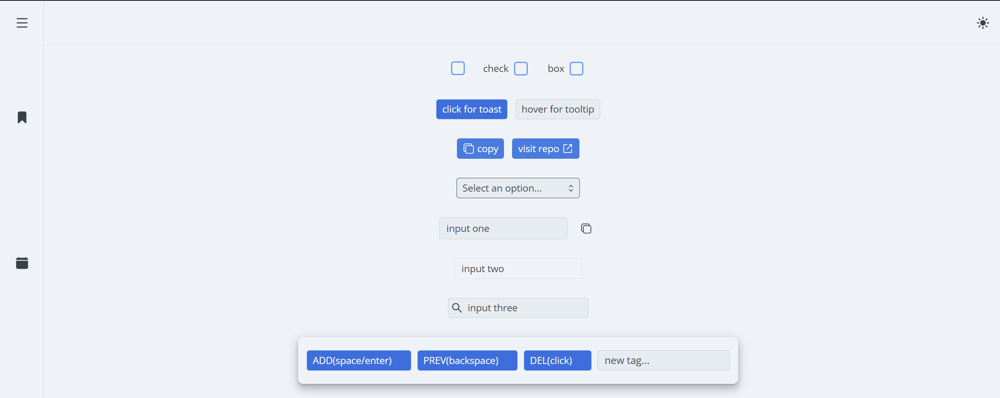

# starter kit : preact
<figure>

<figcaption align="center">light mode <b>(also includes dark/contrast options)</b></figcaption>
</figure>
Designed to deliver an easily configurable system to acheive perfect lighthouse scores without sacrificing tooling/functionality. 

If you prefer react, I have a version built with that as well.

tooling : vite

* typed components
* adheres to aria guidelines
  * logical tab order (all interactive elements are focusable)
  * offscreen component content will not appear to aria
  * proper roles/labels/attributes
  * accessible names
* adheres to all trust & safety best practices
* lighthouse (100 100 100 100)
* Custom Components :
  * Tooltip Component
    * close on click outside
    * 4 base configurations (left/right/bottom/top)
    * dynamic positioning (left & right bounds)
    * easy configuration (wrap element & provide title)
  * Toast Component (popups/alerts)
    * close on click outside
    * pass callback
    * timeout
  * Select Component
    * close on click outside
    * dynamic positioning (opens on top or bottom depending on space)
  * Tag Component
  * Checkbox Component
* Other Components :
  * Sidebar
  * Header
  * Link
  * Button / SVG button
  * Input / forwardInput / Input + SVG
* all components have both dark/primary variations for each theme
* Built with mobile first in mind - responsive for any orientation
* three themes (light, medium, dark) with theme-swap & local storage already implemented
  * all three themes adhere to contrast guidelines
* over 100 reusable CSS classes
* custom CSS reset
* minimal queries - five rules
* three locally downloaded & configured fonts to choose from (!use only 2)
* only relies on one external library other than react itself (react-icons)
* all modal elements come with close on click outside functionality
* pre-configured fake data for testing of any sort
* utility functions:
  * 9 date/time methods
  * copy to clipboard method
  * form validation
* custom hooks:
  * useDebounce
  * useFetch
  * useIsFirstRender
  * useLocal
